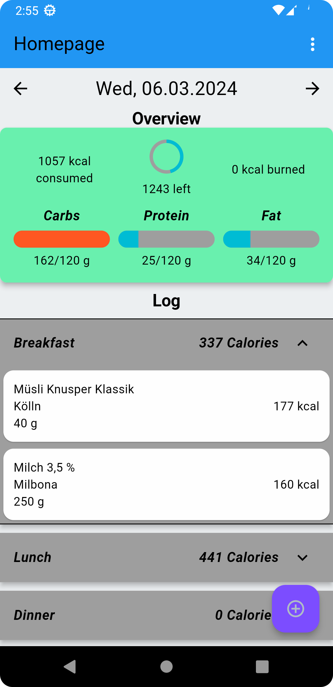
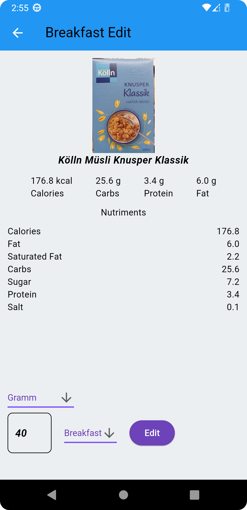
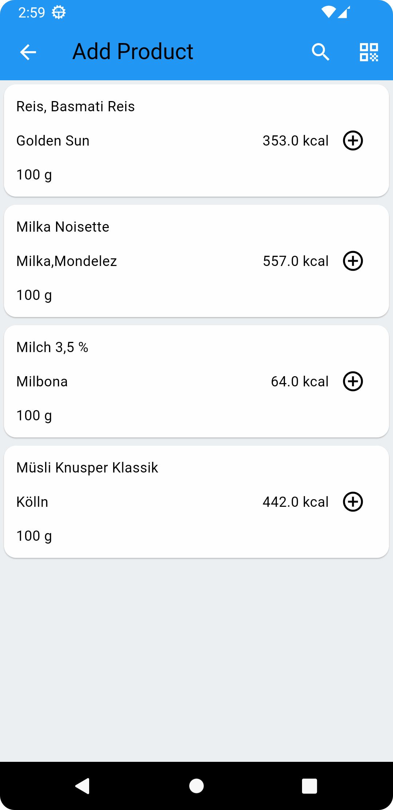
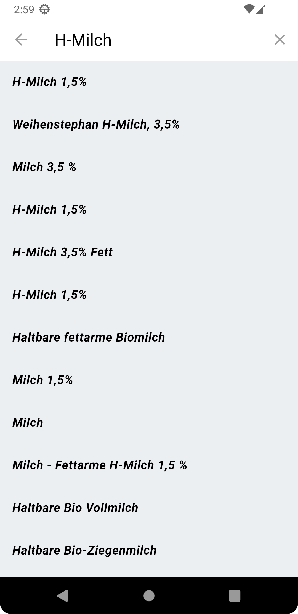

# Foodtracker

A simple foodtracker for Android created with Flutter.\
The project structure is based on [resocoder.com](https://resocoder.com/2020/03/09/flutter-firebase-ddd-course-1-domain-driven-design-principles/).\
The data comes from the API of [Open Food Facts](https://world.openfoodfacts.org/).

## Features

- Create a diary and count calories and nutrients
- Search products by name or EAN barcode
- Add entry with weight or number of servings, if available
- Edit or delete entries

## Required Permission

- Camera
- Internet

## Requirements

The project requires at least Android 6 API Version 23.

## Screenshots

## Usage
- clone this repository
- run `flutter pub get`
- run `flutter run`